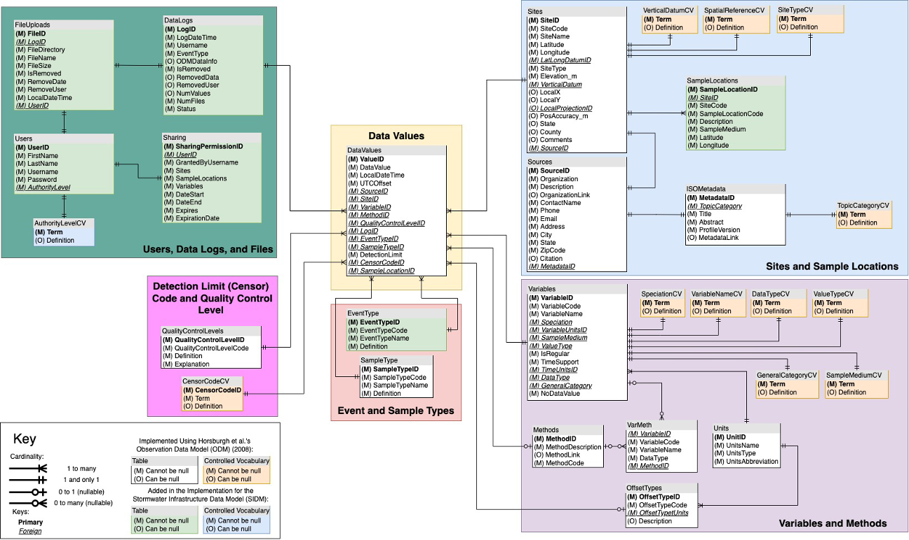

## Stormwater Infrastructure Data Model (SIDM)
The SIDM, constructed similarly to [Observations Data Model](https://doi.org/10.1029/2007WR006392) (established by [CUAHSI](https://www.cuahsi.org/), is a SQL server database that uses relational tables to organize disparate types of data, as well as minimize database size and maximize data retrieval speed. The [Villanova Center for Resilient Water Systems (VCRWS)](https://www1.villanova.edu/university/engineering/faculty-research/Resilient-Water-Systems.html) has created this database to experiment with the organization of their data for deeper and more comprehensive spatio-temporal analysis. The relational format allows for an interface in which time series of dissimilar data from a range of projects can be retrieved and compared; however, the SIDM has added additional tables to build on the [ODM structure](https://github.com/ODM2/ODM2) to focus on stormwater infrastructure data.

### SIDM SQL Implementation
The SQL implementation of the SIDM is available here in this repository at:

[SIDM](https://github.com/VCRWS/SIDM)  
&nbsp;&nbsp;└ [src](https://github.com/VCRWS/SIDM)  
&nbsp;&nbsp;&nbsp;&nbsp;&nbsp;&nbsp;&nbsp;&nbsp;└ [SIDM.sql](https://github.com/VCRWS/SIDM/blob/main/src/SIDM.sql)

### Core Schema
Below is the core schema for the SIDM. The core of the SIDM is based heavily on the ODM. It departs from the original model by adding the following capabilities:

* **Detection limit system (DetectionLimit/DetectionLevel):** where the concentration of an analyte or variable of interest can be flagged as falling below the  acceptable threshold of detection by the lab instrumentation. CUAHSI’s ODM has a series of sensor codes which could be used to identify if a value had a detection limit. Here we added a new column that stores the actual limit itself, as well as the sensor code.

* **Event type (EventType):** base flow and storm flow indicators, the difference between these two environmental conditions has drastic impacts on water quality indicators and watershed health.

* **Sample location (SampleLocations):** to differentiate between duplicate variables measured at a given site, typically for comparison purposes across space. Sample locations can be thought of as “sub-sites” in that they are simply a spatial extension of the original site codes.

* **Sample type (SampleType):** to differentiate between how the sample was collected.  This allows for data to be categorized as grab, composite, continuous, or autosample.  Multiple autosample options exist to account for  duplicates. This data serves to aid in longterm data reuse to identify potential sources of discrepancy associated with  new sampling methods.

* **Data Logs and User Permissions:** For keeping track of data uploaded to the SIDM via the [VCRWS Database webpage](https://vcrws.villanova.edu) and managing users of the VCRWS Database.

### Credits
The data model described in this repository was developed using data and resources from the [Villanova Center for Resilient Water Systems (VCRWS)](https://www1.villanova.edu/university/engineering/faculty-research/Resilient-Water-Systems.html).  The data model described was inspired by and based on the [Cortsortium of Universities for the Advancement of Hydrologic Science, Inc. (CUAHSI)](https://www.cuahsi.org/) Observation Data Model (ODM) (Horsburgh et al., 2008), and [Observation Data Model 2 (ODM2)](https://github.com/ODM2/ODM2) (Horsburgh et al., 2016).

### References

Horsburgh, J. S., Tarboton, D. G., Maidment, D. R., & Zaslavsky, I. (2008). A relational model for environmental and water resources data. Water Resources Research, 44(5). https://doi.org/10.1029/2007WR006392  
Horsburgh, J. S., Aufdenkampe, A. K., Mayorga, E., Lehnert, K. A., Hsu, L., Song, L., et al. (2016). Observations Data Model 2: A community information model for spatially discrete Earth observations. Environmental Modelling & Software, 79, 55–74. https://doi.org/10.1016/j.envsoft.2016.01.010
